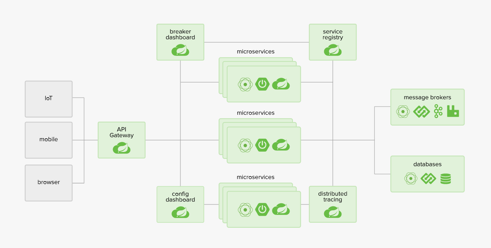

# SpringCloud

### 1.springcloud架构和常用网站

> 1.官网：https://spring.io/projects/spring-cloud
>
> 2.参考书：
>
> ​	2.1、https://www.springcloud.cc/spring-cloud-netflix.html
>
> ​	2.2、API：https://www.springcloud.cc/spring-cloud-dalston.html
>
> 3.springcloud中文网：https://www.springcloud.cc/

### 2.项目版本

**spring cloud版本：Dalston.SR1**

**spring boot版本：1.5.19.RELEASE**