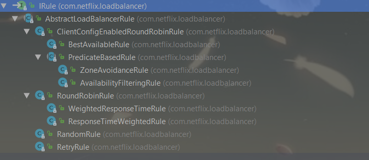
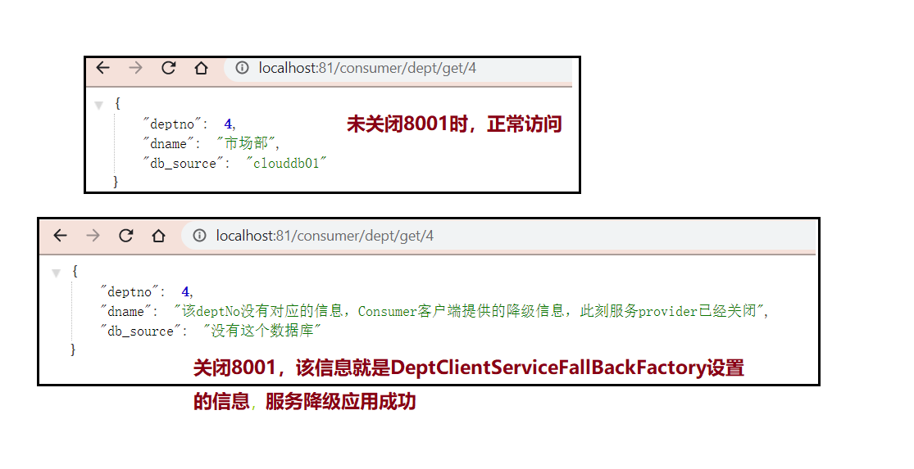
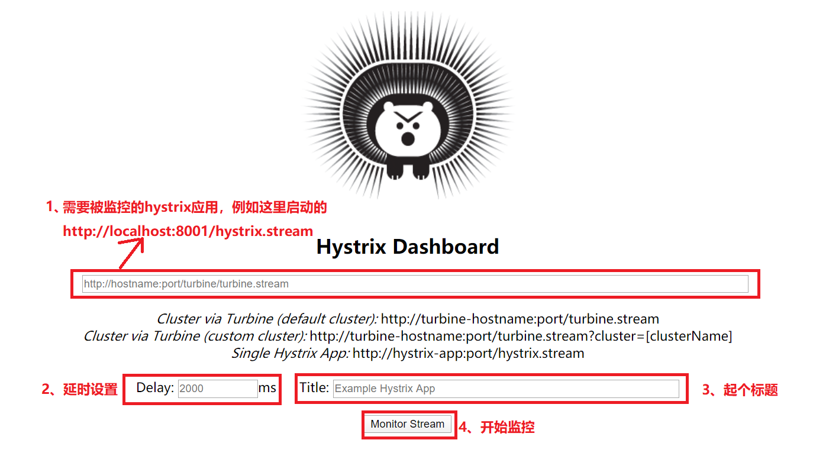

 SpringCloud

## 一、springcloud架构和常用网站


> 1.官网：https://spring.io/projects/spring-cloud
>
> 2.参考书：
>
> ​	2.1、https://www.springcloud.cc/spring-cloud-netflix.html
>
> ​	2.2、API：https://www.springcloud.cc/spring-cloud-dalston.html
>
> 3.springcloud中文网：https://www.springcloud.cc/

## 二、项目版本

**spring cloud版本：Dalston.SR1**

**spring boot版本：1.5.19.RELEASE**

## 三、环境搭建

### 1、父工程（microservicecloud）

* pom文件

```xml
<?xml version="1.0" encoding="UTF-8"?>
<project xmlns="http://maven.apache.org/POM/4.0.0"
         xmlns:xsi="http://www.w3.org/2001/XMLSchema-instance"
         xsi:schemaLocation="http://maven.apache.org/POM/4.0.0 http://maven.apache.org/xsd/maven-4.0.0.xsd">
    <modelVersion>4.0.0</modelVersion>

    <groupId>com.trd.springcloud</groupId>
    <artifactId>microservicecloud</artifactId>
    <version>1.0</version>
    <packaging>pom</packaging>

    <!--工具包和源码的版本管理-->
    <properties>
        <project.build.sourceEncoding>UTF-8</project.build.sourceEncoding>
        <maven.compiler.source>1.8</maven.compiler.source>
        <maven.compiler.target>1.8</maven.compiler.target>
        <junit.version>4.12</junit.version>
        <log4j.version>1.2.17</log4j.version>
        <spring-boot.version>1.5.19.RELEASE</spring-boot.version>
        <spring-cloud.version>Dalston.SR1</spring-cloud.version>
        <logback.version>1.2.3</logback.version>
        <lombok.version>1.18.6</lombok.version>
        <mybatis-spring-boot-starter.version>1.3.0</mybatis-spring-boot-starter.version>
        <!--一定要注意MySQL-Connector和Druid的版本问题，
                否则容易出现MySqlValidConnectionChecker错误-->
        <druid.version>1.0.6</druid.version>
        <mysql-connector.version>5.1.25</mysql-connector.version>
    </properties>

    <!--对子模块依赖的版本管理，不负责引进-->
    <dependencyManagement>
        <dependencies>
            <dependency>
                <groupId>org.springframework.cloud</groupId>
                <artifactId>spring-cloud-dependencies</artifactId>
                <version>${spring-cloud.version}</version>
                <type>pom</type>
                <scope>import</scope>
            </dependency>
            <dependency>
                <groupId>org.springframework.boot</groupId>
                <artifactId>spring-boot-dependencies</artifactId>
                <version>${spring-boot.version}</version>
                <type>pom</type>
                <scope>import</scope>
            </dependency>
            <dependency>
                <groupId>mysql</groupId>
                <artifactId>mysql-connector-java</artifactId>
                <version>${mysql-connector.version}</version>
            </dependency>
            <dependency>
                <groupId>com.alibaba</groupId>
                <artifactId>druid</artifactId>
                <version>${druid.version}</version>
            </dependency>
            <dependency>
                <groupId>org.mybatis.spring.boot</groupId>
                <artifactId>mybatis-spring-boot-starter</artifactId>
                <version>${mybatis-spring-boot-starter.version}</version>
            </dependency>
            <dependency>
                <groupId>log4j</groupId>
                <artifactId>log4j</artifactId>
                <version>${log4j.version}</version>
            </dependency>
            <dependency>
                <groupId>ch.qos.logback</groupId>
                <artifactId>logback-core</artifactId>
                <version>${logback.version}</version>
            </dependency>
            <dependency>
                <groupId>junit</groupId>
                <artifactId>junit</artifactId>
                <version>${junit.version}</version>
                <scope>test</scope>
            </dependency>
        </dependencies>
    </dependencyManagement>
</project>
```

### 2、通用工程（microservicecloud-api）

* pom文件

```xml
<?xml version="1.0" encoding="UTF-8"?>
<project xmlns="http://maven.apache.org/POM/4.0.0"
         xmlns:xsi="http://www.w3.org/2001/XMLSchema-instance"
         xsi:schemaLocation="http://maven.apache.org/POM/4.0.0 http://maven.apache.org/xsd/maven-4.0.0.xsd">
    <modelVersion>4.0.0</modelVersion>
    <parent>
        <artifactId>microservicecloud</artifactId>
        <groupId>com.trd.springcloud</groupId>
        <version>1.0</version>
        <!--采用相对路径，改动测试起来更方便-->
        <relativePath>../microservicecloud/pom.xml</relativePath>
    </parent>

    <artifactId>microservicecloud-api</artifactId>
    <dependencies>
        <!--lombok的jar包-->
        <dependency>
            <groupId>org.projectlombok</groupId>
            <artifactId>lombok</artifactId>
        </dependency>

    </dependencies>
</project>
```

### 3、服务的提供者（microservicecloud-provider-dept-8001）

* pom文件

```xml
<?xml version="1.0" encoding="UTF-8"?>
<project xmlns="http://maven.apache.org/POM/4.0.0"
         xmlns:xsi="http://www.w3.org/2001/XMLSchema-instance"
         xsi:schemaLocation="http://maven.apache.org/POM/4.0.0 http://maven.apache.org/xsd/maven-4.0.0.xsd">
    <modelVersion>4.0.0</modelVersion>
    <!--父模块-->
    <parent>
        <artifactId>microservicecloud</artifactId>
        <groupId>com.trd.springcloud</groupId>
        <version>1.0</version>
        <relativePath>../microservicecloud/pom.xml</relativePath>
    </parent>

    <artifactId>microservicecloud-provider-dept-8001</artifactId>

    <dependencies>
        <!--引入自己编写的api模块的jar包,版本跟着项目走-->
        <dependency>
            <groupId>com.trd.springcloud</groupId>
            <artifactId>microservicecloud-api</artifactId>
            <version>${project.version}</version>
        </dependency>

        <!--junit-->
        <dependency>
            <groupId>junit</groupId>
            <artifactId>junit</artifactId>
        </dependency>
        <!--mysql-->
        <dependency>
            <groupId>mysql</groupId>
            <artifactId>mysql-connector-java</artifactId>
        </dependency>
        <!--druid连接池-->
        <dependency>
            <groupId>com.alibaba</groupId>
            <artifactId>druid</artifactId>
        </dependency>
        <!--日志logback-->
        <dependency>
            <groupId>ch.qos.logback</groupId>
            <artifactId>logback-core</artifactId>
        </dependency>
        <!--mybatis整合springboot的starter-->
        <dependency>
            <groupId>org.mybatis.spring.boot</groupId>
            <artifactId>mybatis-spring-boot-starter</artifactId>
        </dependency>
        <!--springboot的web的starter-->
        <dependency>
            <groupId>org.springframework.boot</groupId>
            <artifactId>spring-boot-starter-web</artifactId>
            <!--排除Tomcat-->
            <exclusions>
                <exclusion>
                    <groupId>org.springframework.boot</groupId>
                    <artifactId>spring-boot-starter-tomcat</artifactId>
                </exclusion>
            </exclusions>
        </dependency>
        <!--嵌入式jetty服务器，不用tomcat-->
        <dependency>
            <groupId>org.springframework.boot</groupId>
            <artifactId>spring-boot-starter-jetty</artifactId>
        </dependency>
        <!--springboot的test的starter-->
        <dependency>
            <groupId>org.springframework.boot</groupId>
            <artifactId>spring-boot-starter-test</artifactId>
        </dependency>

        <!--热部署 修改后立即生效-->
        <dependency>
            <groupId>org.springframework</groupId>
            <artifactId>springloaded</artifactId>
        </dependency>
        <dependency>
            <groupId>org.springframework.boot</groupId>
            <artifactId>spring-boot-devtools</artifactId>
        </dependency>
    </dependencies>

</project>
```

* application.yml文件

```yaml
server:
  port: 8001
mybatis:
#  config-location: classpath:mybatis/mybatis.cfg.xml       mybatis配置文件的路径
  type-aliases-package: com.trd.springcloud.entities      #  mybatis别名包位置
  mapper-locations:                                       #  mybatis的mapper.xml文件路径
    - classpath:mybatis/mapper/*.xml
  configuration:
    cache-enabled: true
spring:
  application:
    name: microservicecloud-dept                          #该application的名称
  datasource:
    type: com.alibaba.druid.pool.DruidDataSource          # DataSource类型
    driver-class-name: com.mysql.jdbc.Driver              # MySQL驱动器
    username: root
    password: 123456
    url: jdbc:mysql://localhost:3306/clouddb01
    dbcp2:
      min-idle: 5                                         # 最小空闲数
      initial-size: 5                                     # DataSource初始化大小
      max-total: 5                                        # 最大连接数
      max-wait-millis: 200                                # 连接超时时间（毫秒）

```

* 启动类

```java
package com.trd.springcloud;

import org.mybatis.spring.annotation.MapperScan;
import org.springframework.boot.SpringApplication;
import org.springframework.boot.autoconfigure.SpringBootApplication;

/**
 * @author Trd
 * @date 2020-02-09 14:57
 */
// mapper的接口包扫描
@MapperScan("com.trd.springcloud.dao")
@SpringBootApplication
public class DeptProvider8001_App {
	public static void main(String[] args) {
		SpringApplication.run(DeptProvider8001_App.class,args);
	}
}

```

### 4、服务的消费者（microservice-cloud-consumer-dept-80）

* pom文件

```xml
<?xml version="1.0" encoding="UTF-8"?>
<project xmlns="http://maven.apache.org/POM/4.0.0"
         xmlns:xsi="http://www.w3.org/2001/XMLSchema-instance"
         xsi:schemaLocation="http://maven.apache.org/POM/4.0.0 http://maven.apache.org/xsd/maven-4.0.0.xsd">
    <parent>
        <artifactId>microservicecloud</artifactId>
        <groupId>com.trd.springcloud</groupId>
        <version>1.0</version>
        <relativePath>../microservicecloud/pom.xml</relativePath>
    </parent>
    <modelVersion>4.0.0</modelVersion>

    <artifactId>microservicecloud-consumer-dept-80</artifactId>
    <dependencies>
        <!--引入自己编写的api模块的jar包,版本跟着项目走-->
        <dependency>
            <groupId>com.trd.springcloud</groupId>
            <artifactId>microservicecloud-api</artifactId>
            <version>${project.version}</version>
        </dependency>
        <!--springboot的web的starter-->
        <dependency>
            <groupId>org.springframework.boot</groupId>
            <artifactId>spring-boot-starter-web</artifactId>
        </dependency>
        <!--热部署 修改后立即生效-->
        <dependency>
            <groupId>org.springframework</groupId>
            <artifactId>springloaded</artifactId>
        </dependency>
        <dependency>
            <groupId>org.springframework.boot</groupId>
            <artifactId>spring-boot-devtools</artifactId>
        </dependency>
    </dependencies>

</project>
```

* yml文件

```yaml
server:
  port: 80             # 只更改服务的端口
```

## 四、Eureka

### 1、Eureka是什么？

​		Eureka是一个**基于REST**的服务，用于定位服务，以实现云端中间层**服务发现和故障转移**。**只使用服务的标识符，就可以访问到服务**，而**不需要修改服务调用的配置文件**。类似于dubbo的注册中心，比如Zookeeper。


### 2、Eureka服务端的配置（microservicecloud-eureka-7001）

	* pom文件

```xml
<?xml version="1.0" encoding="UTF-8"?>
<project xmlns="http://maven.apache.org/POM/4.0.0"
         xmlns:xsi="http://www.w3.org/2001/XMLSchema-instance"
         xsi:schemaLocation="http://maven.apache.org/POM/4.0.0 http://maven.apache.org/xsd/maven-4.0.0.xsd">
    <modelVersion>4.0.0</modelVersion>
    <parent>
        <artifactId>microservicecloud</artifactId>
        <groupId>com.trd.springcloud</groupId>
        <version>1.0</version>
        <relativePath>../microservicecloud/pom.xml</relativePath>
    </parent>

    <artifactId>microservicecloud-eureka-7001</artifactId>

    <dependencies>
        <!--eureka-server 服务端-->
        <dependency>
            <groupId>org.springframework.cloud</groupId>
            <artifactId>spring-cloud-starter-eureka-server</artifactId>
        </dependency>
        <!--热部署 修改后立即生效-->
        <dependency>
            <groupId>org.springframework</groupId>
            <artifactId>springloaded</artifactId>
        </dependency>
        <dependency>
            <groupId>org.springframework.boot</groupId>
            <artifactId>spring-boot-devtools</artifactId>
        </dependency>

    </dependencies>

</project>
```

	* application.yml文件

```yaml
server:
  port: 7001					# 设置Eureka的server端的端口

eureka:
  instance:
    hostname: localhost         # eureka服务端的实例名称,本机注册就是localhost
  client:
    register-with-eureka: false #   false表示不向注册中心注册自己
    fetch-registry: false       #  false 表示自己就是注册中心，职责就是维护服务实例，并不需要去检索服务
    service-url:
      defaultZone: http://${eureka.instance.hostname}:${server.port}/eureka/ #设置与eureka server 交互的地址查询服务和注册服务都需要依赖的地址
```

	* 在该项目的**启动类上加@EnableEurekaServer注解**，用来**启动Eureka的服务端，接受其它微服务的注册**
	* 测试：浏览器打开 localhost:7001,出现

标准，则成功

3、在以前的项目中新增配置，完善Eureka

* 模块microservicecloud-provider-dept-8001的pom文件新增

  ```xml
      <!--将微服务provider注册进eureka-->
      <!--eureka的client端，和cloud的config-->
      <dependency>
          <groupId>org.springframework.cloud</groupId>
          <artifactId>spring-cloud-starter-eureka</artifactId>
      </dependency>
      <dependency>
          <groupId>org.springframework.cloud</groupId>
          <artifactId>spring-cloud-starter-config</artifactId>
      </dependency>     
      <!--actuator（制动器），监控自信息完善-->
      <dependency>
          <groupId>org.springframework.boot</groupId>
          <artifactId>spring-boot-starter-actuator</artifactId>
      </dependency>
  ```

* 模块microservicecloud-provider-dept-8001的yml文件新增

  ```yaml
  #客户端注册进eureka服务列表
  eureka:
    client:
      service-url:
        defaultZone: http://localhost:7001/eureka
    instance:
      instance-id: microservicecloud-dept:8001   # Eureka的服务端的该微服务名Status名修改
      prefer-ip-address: true                    # 访问路径显示IP地址
  info:
    app.name: microservice-SpringCloud
    company.name: www.trd.com
    build.artifactId: $project.artifactId$
    build.version: $project.version$
  ```

* 模块microservicecloud-provider-dept-8001的启动类上新加注解**@EnableEurekaClient**，用来**启动Eureka的client端，将其注册到Eureka的server端**

* 父工程（microservicecloud）的pom文件添加

  ```xml
      <build>
          <!--finalName 父工程名称-->
          <finalName>microservicecloud</finalName>
          <resources>
              <resource>
                  <!--开启maven工程的主resource的所有文件过滤-->
                  <directory>src/main/resources</directory>
                  <filtering>true</filtering>
              </resource>
          </resources>
          <!--增加插件-->
          <plugins>
              <plugin>
                  <groupId>org.apache.maven.plugins</groupId>
                  <artifactId>maven-resources-plugin</artifactId>
                  <version>3.0.2</version>
                  <!--配置插件解析-->
                  <configuration>
                      <delimiters>
                          <!--占位符的替换规则设置，
                              以$符为界限,取过滤的resources中以$*$之间的信息-->
                          <delimiter>$</delimiter>
                      </delimiters>
                  </configuration>
              </plugin>
          </plugins>
      </build>
  ```

* 8001的yml文配置新增图解

### 4、Eureka的自我保护机制

* Eureka遵循AP原则，ZooKeeper遵循CP原则
* 自我保护提示

>​		默认情况下，**如果EurekaServer在一定时间内没有接收到某个微服务实例的心跳，Eureka Server将会注销实例（默认90秒）**。但是当网络分区故障发生时，微服务与Eureka Server之间无法正常通信，以上行为可能变得非常危险，因为微服务本身其实是健康的，此时本不应该注销这个服务。Eureka通过“自我保护模式”来解决这个问题，**当Eureka Server节点在短时间内丢失过多客户端时（可能发生网络故障），那么这个节点就会进入自我保护模式**。一旦**进入该模式，Eureka Server就会保护服务注册表中的信息，不再删除服务注册表中的数据（也即不会注销任何微服务）。当网络故障恢复后，该Eureka Server节点会自动退出自我保护模式。**
>
>​		**在自我保护模式中，Eureka Server会保护服务注册表中的信息，不再注销任何实例。当它收到的心跳数重新恢复到阈值以上时，该Eureka Server 节点就会自动退出自我保护模式。宁可保留错误的服务注册信息，也不盲目注销任何健康的服务实例，好死不如赖活着。使用自我保护模式，可以让Eureka集群更加的健壮、稳定。**
>
>​	在springcloud中，可以配置eureka.server.enable-self-preservation=false来禁用自我保护模式（不推荐）

### 5、Eureka服务发现（discovery）

> 对于注册进Eureka里的微服务，可以痛过服务发现来获取该服务的信息

* microservicecloud-provider-dept-8001模块里的Controller加入

  ```java
      // IDEA提示有两个DiscoveryClient,用@Qualifier限定一下
      @Autowired
      @Qualifier("discoveryClient")
      private DiscoveryClient client;
  
  	@GetMapping(value = "/dept/discovery")
  	public Object discovery(){
  		// 获取全部服务的id
  		List<String> list = client.getServices();
  		System.out.println("全部服务"+list);
  		// 查询serviceId对应的服务实例
  		List<ServiceInstance> instances = client.getInstances("microservicecloud-dept");
  
  		for (ServiceInstance element :instances){
  			System.out.println("serviceId: "+element.getServiceId());
  			System.out.println("host: "+element.getHost());
  			System.out.println("port: "+element.getPort());
  			System.out.println("uri: "+element.getUri());
  		}
  		return this.client;
  	}
  ```

* microservicecloud-provider-dept-8001启动类加入**@EnableDiscoveryClient**注解（我没有加入也成功了）

* 访问localhost:8001/dept/discovery，出现如下，则成功

### 6、Eureka的集群

#### (1)C:/Windows/System32/drivers/etc/hosts文件新增以下域名映射

#### (2)新增microservicecloud-eureka-7002和microservicecloud-eureka-7003模块

* yml和pom文件复制microservicecloud-eureka-7001的

* yml文件修改部分(defaultZone互相添加其他的url，以microservicecloud-eureka-7002为例)

  ```yml
  eureka:
    instance:
      hostname: eureka7002.com  # 因为集群配置中hostname不能重复，所以在hosts文件中做了映射
  eureka:
    client:
      service-url:
      # 单机版配置 
      # defaultZone: http://${eureka.instance.hostname}:${server.port}/eureka/ #设置与eureka server 交互的地址查询服务和注册服务都需要依赖的地址
      # 集群配置
        defaultZone:
        	http://eureka7001.com:7001/eureka/,http://eureka7003.com:7003/eureka/
  ```

* 启动类和microservicecloud-eureka-7001一样

#### (3)microservicecloud-provider-dept-8001yml文件修改

```yaml
#客户端注册进eureka服务列表
eureka:
  client:
    service-url:
      defaultZone: 		     	# eureka客户端添加其余所有的集群eureka server的url  
         http://eureka7001.com:7001/eureka,
         http://eureka7002.com:7002/eureka,
         http://eureka7003.com:7003/eureka
```

#### (4)测试

输入eureka server的url，看到如下，则集群成功

### 7、Eureka和zookeeper的比较

#### (1).CAP理论

> ​		**一个分布式系统不可能同时很好地满足一致性(Consistency)、可用性(Availability )和分区容错性(Partition tolerance)**，**最多只能较好的同时满足两个**。因此，根据CAP原理将NoSQL数据库分成了满足CA原则、CP原则和AP原则三类
>
> CA：单点集群，满足一致性，可用性的系统，可扩展性则不强
>
> CP：满足一致性，分区容忍性的系统，通常性能不高
>
> AP：满足可用性，分区容忍性的系统，对一致性的要求低一些

**而由于当前的网络硬件肯定会出现延迟丢包等问题，所以，分区容错性我们必须要实现**

#### (2).zookeeper保证CP

> ​		**当zookeepe的master节点因为网络故障与其他节点失去联系时，剩余节点会重新进行leader选举。如果leader选举时间过长，30~120s，则这个期间整个zookeeper集群都不可用，导致这期间服务瘫痪**。而在云部署的情况下，网络问题让zookeeper集群失去master节点概率较大，尽管最终能恢复，但选举时间长使我们不能容忍的。

#### (3).Eureka保证AP

>​		**Eureka的各个节点都平等**，几个节点挂掉不会影响正常节点的工作，剩余节点依然可提供服务。因为**Eureka客户端在向某个Eureka注册或时如果发现连接失败，则会自动切换至其它节点，只要有一台Eureka还在,就能保证注册服务可用(保证可用性)**，只不过查到的信息可能不是最新的(**不保证强一致性**)。除此之外，Eureka还有一种**自我保护机制**，如果在15分钟内超过85%的节点都没有正常的心跳,那么Eureka就认为客户端与注册中心出现了网络故障，此时会出现以下几种情况:
>1. Eureka不再从注册列表中移除因为长时间没收到心跳而应该过期的服务
>2. Eureka仍然能够接受新服务的注册和查询请求，但是不会被同步到其它节点上(即保证当前节点依然可用)
>3. 当网络稳定时，当前实例新的注册信息会被同步到其它节点。

​		**因此，Eureka可以很好的应对因网络故障导致部分节点失去联系的情况，而不会像zookeeper那样使整 个注册服务瘫痪。**

## 五、Ribbon负载均衡

### 1.Ribbon是什么？

​		**Spring Cloud Ribbon**是基于Netlix Ribbon实现的一套**客户端 负载均衡的工具**。
​		简单的说，Ribbon是Netflix发布的开源项目， 主要功能是提供客户端的软件负载均衡算法，将Netflix的中间层服务连接在一起。
​		Ribbon客户端组件提供一系列完善的配置项如连接超时，重试等。简单的说，就是在配置文件中列出Load Balancer (简称LB)后面所有的机器，Ribbon会自动的帮助你基于某种规则(如简单轮询,随机连接等)去连接这些机器。我们也**很容易使用Ribbon实现自定义的负载均衡算法**。

​		官网资料：https://github.com/Netflix/ribbon/wiki/Getting-Started

### 2.LB(Load Balance，负载均衡)

​		LB,即负载均衡(Load Balance),在微服务或分布式集群中经常用的一种应用。**负载均衡简单的说就是将用户的请求平摊的分配到多个服务上，从而达到系统的HA（高可用）**。常见的负载均衡有软件Nginx, LVS,硬件F5等。

### 3.Ribbon的初步配置

#### (1).microservice-cloud-consumer-dept-80模块的pom文件新增

```xml
        <!--Ribbon相关引用，与eureka有关-->
        <dependency>
            <groupId>org.springframework.cloud</groupId>
            <artifactId>spring-cloud-starter-eureka</artifactId>
        </dependency>
        <dependency>
            <groupId>org.springframework.cloud</groupId>
            <artifactId>spring-cloud-starter-ribbon</artifactId>
        </dependency>
        <dependency>
            <groupId>org.springframework.cloud</groupId>
            <artifactId>spring-cloud-starter-config</artifactId>
        </dependency>
```

#### (2).microservice-cloud-consumer-dept-80模块的yml文件新增

```yaml
eureka:
  client:
    register-with-eureka: false  # 不将自己注册到eureka server
    service-url:
      defaultZone: 
          http://eureka7001.com:7001/eureka,
          http://eureka7002.com:7002/eureka,
          http://eureka7003.com:7003/eureka

```

#### (3).microservice-cloud-consumer-dept-80模块修改Configuration类

在向容器中注入org.springframework.web.client.RestTemplate类时，方法上加入**@LoadBalanced注解，以表示开启使用负载均衡客户端**

```java
@Configuration
public class ConfigBean {
	@Bean
	@LoadBalanced
	public RestTemplate getRestTemplate(){
		return new RestTemplate();
	}
}
```

#### (4).microservice-cloud-consumer-dept-80启动类加入@EnableEurekaClient注解

#### (5).修改microservice-cloud-consumer-dept-80模块的ConsumerController客户端访问类

```java
	// 使用Ribbon，只提供applicationName,不再使用域名+端口号的固定写法了
	/*	
	注意：这么写了，在之后的restTemplate调用方法时的拼接url，记得用'/'隔开，
		 因为这种写法不会在下面的例子'microservicecloud-dept'之后自动加上'/'
	 */
	private static final String REST_URL_PREFIX = "http://microservicecloud-dept";
```

#### (6).测试

​		依次启动7001,7002,7003，在启动8001，最后启动80，浏览器访问localhost/consumer/dept/list，如访问成功，则成功

### 4.Ribbon负载均衡

#### (1).新建microservicecloud-provider-dept-8002和microservicecloud-provider-dept-8003模块

这两个新建的模块内容都复制microservicecloud-provider-dept-8001的

#### (2).yml文件更改的内容(和自己模块名对应，spring.application.name不要修改)

```yaml
server:
  port: 8002        # 修改访问端口  
spring:
  application:
    name: microservicecloud-dept                    # 不要修改，和8001的保持一致
  datasource:
    url: jdbc:mysql://localhost:3306/clouddb02    # 修改数据库，验证轮回算法

eureka:
  client:
  instance:
    instance-id: microservicecloud-dept:8002   # 修改注册进eureka server的实例id

```

#### (3).新建clouddb02、clouddb02数据库，和clouddb01内容一致

```sql
/*  
	只改数据库名字
*/
DROP DATABASE IF EXISTS cloudDB02;
CREATE DATABASE cloudDB02 CHARACTER SET UTF8;
USE cloudDB02;
CREATE TABLE dept
(
	deptno 	BIGINT NOT NULL PRIMARY KEY AUTO_INCREMENT,
	dname VARCHAR(60),
	db_source VARCHAR(60)
);

INSERT INTO dept(dname,db_source) VALUES('开发部',DATABASE());
INSERT INTO dept(dname,db_source) VALUES('人事部',DATABASE());
INSERT INTO dept(dname,db_source) VALUES('财务部',DATABASE());
INSERT INTO dept(dname,db_source) VALUES('市场部',DATABASE());
INSERT INTO dept(dname,db_source) VALUES('运维部',DATABASE());

SELECT * FROM dept;
```

#### (4).测试

​		依次启动7001，7002，7003，8001，8002，8003，80的服务，测试80端口的访localhost/consumer/dept/list，每次刷新，查看数据库名字是否依次循环变化，即是否使用到了Ribbon的轮询算法

#### (5).总结

​		Ribbon其实就是一个软负载均衡的客户端组件，他可以和其他所需请求的客户端结合使用，和Eureka结合只是其中的一个实例。默认采用轮询算法。

### 5.Ribbon的核心组件IRule

#### (1).IRule：根据特定算法从服务列表中选择一个要访问的服务，是一个顶级接口

```java
public interface IRule{
	// 根据自定义的算法，选择服务
    public Server choose(Object key);
    // 设置
    public void setLoadBalancer(ILoadBalancer lb);
    // 获取
    public ILoadBalancer getLoadBalancer();    
}
```

#### (2).Ribbon自带的IRule实现类（都在com.netflix.loadbalancer包下算法类）



>1.RoundRobinRule：轮询算法
>
>2..RandomRule：随机选择算法
>
>3.AvailabilityFilteringRule：会先过滤掉由于多次访问故障而处于断路器跳闸状态的服务、还有并发的连接数量超过阈值的服务，然后对剩余的服务列表按照轮询策略进行访问
>
>4.WeightedResponseTimeRule：根据平均响应时间计算所有服务的权重，响应时间越快的服务权重越大，选中的概率越高。刚启动时如果统计信息不足，则使用RoundRobinRule策略，等统计信息足够，会切换到WeightedResponseTimeRule
>
>5.RetryRule：先按RoundRobinRule轮询算法获取服务，如果失败则在指定时间内进行重试，获取可用的服务。
>
>6.BestAviableRule：会先过滤掉由于多次访问故障而处于断路器跳闸状态的服务，然后选择一个并发量最小的服务
>
>7.ZoneAvoidanceRule：默认规则，符合判断server所在区域的性能和server的可用性选择服务器

​		***要改变Ribbon的选择server规则，可以把对应的IRule实现类先实例化，在用@Bean注解注入进spring容器中。***

### 6.自定义Ribbon的负载均衡算法

#### (1).目标：类似轮询算法，每个server使用3次，再进行轮询

#### (2).配置注意细节

​		**自定义配置类不能放在@ComponentScan所扫描的当前包以及子包下，否则我们自定义的这个配置类就会被所有的Ribbon客户端锁共享，达不到特殊定制化的目的**

#### (3).实现

自定义MyRoundRobinThreeTimesRule类，复制RoundRobinRule类的源码的基础上再做如下改动

```java
	
	// 自定义的计数器，这个服务被选则了多少次
	private int count = 0;
	// ============================= 只修改这个方法
	private int incrementAndGetModulo(int modulo) {

		int current = nextServerCyclicCounter.get();
		// 修改的部分，保证每个服务轮询3次
		count++;
		if (count > 3) {
			// total不设为0，是因为这次选择本来就会返回一次，如果为0则每个服务会多轮一次
			count = 1;
			for (; ; ) {
				int next = (current + 1) % modulo;
				if (nextServerCyclicCounter.compareAndSet(current, next))
					return next;
			}
		} else {
			return current;
		}
	}
```

#### (4).注入进容器(这个类单独建包，原因在上面第2点)

```java
@Configuration
public class MyRule {
	@Bean
	public IRule getMyRule(){
		return new MyRoundRobinThreeTimesRule();
	}
}

```

#### (5).启动类上添加注解

在启动该微服务时，去加载我们定义的Ribbon配置类

```java
// name就是注入进eureka server的eureka client的名字
@RibbonClient(name="microservicecloud-dept",configuration = MyRule.class)
```

#### (6).测试

启动全部服务，浏览器访问localhost/consumer/dept/list，依次刷新，查看是否每个服务使用3次再轮询

## 六、Feign负载均衡

### 1.Feign概述

​	**官网**：https://cloud.spring.io/spring-cloud-openfeign/reference/html/

> ​		Feign是一个**声明式WebService客户端**。 使用Feign能让编写Web Service客户端更加简单,它的使用方法是定义一个接口,然后在上面添加注解，同时也支持JAX-RS标准的注解。 Feign也支持可拔插式的编码器和解码器。Spring Cloud对Feign进行了封装,使其**支持了Spring MVC标准注解和HttpMessageConverters**. **Feign可以与Eureka和Ribbon组合使用以支持负载均衡**。
>
> ​		**只需要创建一个接口，然后再上面添加注解即可方便的使用Feign，面向接口编程**

### 2.Feign能干什么

> ​	Feign旨在使编写Java Http客户端变得更容易。
> ​	前面在使用Ribbon+ RestTemplate时，利用RestTemplate对http请求的封装处理，形成了一套模版化的调用方法。但是在实际开发中，由于**对服务依赖的调用可能不止一处， 往往一 个接口会被多处调用，所以通常都会针对每个微服务自行封装一 些客户端类来包装这些依赖服务的调用**。所以, Feign在此基础上做了进一 步封装,由他来帮助我们定义和实现依赖服务接口的定义。在Feign的实现下，我们**只需创建一个接口并使用注解的方式来配置它(以前是Dao接口上面标注Mapper注解现在是一个微服务接口上面标注一个Feign注解即可)**，即可完成对服务提供方的接口绑定，简化了使用Spring cloud Ribbon时，自动封装服务调用客户端的开发量。

### 3.构建Feign工程

#### (1).新建microservice-cloud-consumer-dept-feign-81模块

* pom文件

```xml
<?xml version="1.0" encoding="UTF-8"?>
<project xmlns="http://maven.apache.org/POM/4.0.0"
         xmlns:xsi="http://www.w3.org/2001/XMLSchema-instance"
         xsi:schemaLocation="http://maven.apache.org/POM/4.0.0 http://maven.apache.org/xsd/maven-4.0.0.xsd">
    <parent>
        <artifactId>microservicecloud</artifactId>
        <groupId>com.trd.springcloud</groupId>
        <version>1.0</version>
        <relativePath>../microservicecloud/pom.xml</relativePath>
    </parent>
    <modelVersion>4.0.0</modelVersion>

    <artifactId>microservice-cloud-consumer-dept-feign-81</artifactId>
    <dependencies>
        <!--引入自己编写的api模块的jar包,版本跟着项目走-->
        <dependency>
            <groupId>com.trd.springcloud</groupId>
            <artifactId>microservicecloud-api</artifactId>
            <version>${project.version}</version>
        </dependency>
        <!--springboot的web的starter-->
        <dependency>
            <groupId>org.springframework.boot</groupId>
            <artifactId>spring-boot-starter-web</artifactId>
        </dependency>
        <!--热部署 修改后立即生效-->
        <dependency>
            <groupId>org.springframework</groupId>
            <artifactId>springloaded</artifactId>
        </dependency>
        <dependency>
            <groupId>org.springframework.boot</groupId>
            <artifactId>spring-boot-devtools</artifactId>
        </dependency>
        <!--Ribbon相关引用，与eureka有关-->
     <!--   因为feign底层是使用了ribbon作为负载均衡的客户端，
                而ribbon的负载均衡也是依赖于eureka 获得各个服务的地址，
                所以要引入eureka-client。-->
        <dependency>
            <groupId>org.springframework.cloud</groupId>
            <artifactId>spring-cloud-starter-eureka</artifactId>
        </dependency>
        <dependency>
            <groupId>org.springframework.cloud</groupId>
            <artifactId>spring-cloud-starter-ribbon</artifactId>
        </dependency>
        <dependency>
            <groupId>org.springframework.cloud</groupId>
            <artifactId>spring-cloud-starter-config</artifactId>
        </dependency>
        <!--增加Feign的依赖-->
        <dependency>
            <groupId>org.springframework.cloud</groupId>
            <artifactId>spring-cloud-starter-feign</artifactId>
        </dependency>
    </dependencies>

</project>
```

* application.yml文件

```yaml
server:
  port: 81

eureka:
  client:
    register-with-eureka: false  # 不将自己注册到eureka server
    service-url:
      defaultZone: http://eureka7001.com:7001/eureka,http://eureka7002.com:7002/eureka,http://eureka7003.com:7003/eureka

```

#### (2).修改microservicecloud-api模块（公共jar包）

* pom文件新增

  ```xml
          <!--增加Feign的依赖-->
          <dependency>
              <groupId>org.springframework.cloud</groupId>
              <artifactId>spring-cloud-starter-feign</artifactId>
          </dependency>
  ```

* 增加Fegin客户端接口

  ```java
  package com.trd.feign.service;
  
  import com.trd.springcloud.entities.Dept;
  import org.springframework.cloud.netflix.feign.FeignClient;
  import org.springframework.web.bind.annotation.GetMapping;
  import org.springframework.web.bind.annotation.PathVariable;
  import org.springframework.web.bind.annotation.PostMapping;
  
  import java.util.List;
  
  /**
   * @author Trd
   * @date 2020-02-12 11:47
   */
  // 微服务的名字，
  @FeignClient("microservicecloud-dept")
  public interface DeptClientService {
  
  	@PostMapping("/dept/add")
  	boolean add(Dept dept);
  
  	@GetMapping("/dept/get/{id}")
  	Dept findById(@PathVariable("id") Long id);
  
  	@GetMapping("/dept/list")
  	List<Dept> findAll();
  }
  ```

#### (3).microservice-cloud-consumer-dept-feign-81增加启动类和controller

* 启动类

  ```java
  package com.trd.springcloud;
  
  import org.springframework.boot.SpringApplication;
  import org.springframework.boot.autoconfigure.SpringBootApplication;
  import org.springframework.cloud.netflix.eureka.EnableEurekaClient;
  import org.springframework.cloud.netflix.feign.EnableFeignClients;
  
  /**
   * @author Trd
   * @date 2020-02-09 17:05
   */
  @SpringBootApplication
  @EnableEurekaClient
  // 在启动该微服务时，在指定包下去加载我们定义的Feign配置类（即使用了@FeignClient注解的接口）
  @EnableFeignClients("com.trd.feign.service")
  public class FeignDeptConsumer81_APP {
  	public static void main(String[] args) {
  		SpringApplication.run(FeignDeptConsumer81_APP.class, args);
  	}
  }
  ```

* controller

  ```java
  package com.trd.springcloud.controller;
  
  import com.trd.feign.service.DeptClientService;
  import com.trd.springcloud.entities.Dept;
  import org.springframework.beans.factory.annotation.Autowired;
  import org.springframework.web.bind.annotation.PathVariable;
  import org.springframework.web.bind.annotation.RequestMapping;
  import org.springframework.web.bind.annotation.RestController;
  
  import java.util.List;
  
  @RestController
  public class FeignConsumerController {
      
      /**
  	 *  注入进使用了@FeignClient注解的接口，动态代理会去实现
  	 */
  	@Autowired
  	private DeptClientService deptClientService;
      
  	// 添加
  	@RequestMapping("consumer/dept/add")
  	public boolean add(Dept dept){
  		System.out.println(dept);
  		return deptClientService.add(dept);
  	}
  	// 查询一个
  	@RequestMapping("consumer/dept/get/{id}")
  	public Dept findById(@PathVariable("id") Long id){
  		return deptClientService.findById(id);
  	}
  	// 查询所有
  	@RequestMapping("consumer/dept/list")
  	public List<Dept> findAll(){
  		return deptClientService.findAll();
  	}
  }
  ```

#### (4).测试

​		依次启动7001，7002，7003，在启动8001，8002，8003最后启动81，浏览器访问localhost:81/consumer/dept/list，如访问成功，则成功

### 4.总结

* Fegin集成了Ribbon,而与Ribbon不同的是，通过Feign只需要定义服务绑定接口且以声明式的方法，优雅而简单的实现了服务调用
* Feign通过接口的方法调用Rest服务(之前是Ribbon+ RestTemplate) ,该请求发送给Eureka服务器(http://microservicecloud-dept/dept/list) ,通过Feign直接找到服务接口，由于在进行服务调用的时候融合了Ribbon技术,所以也**支持负载均衡作用**。

## 七、Hystrix断路器

### 1、分布式系统的问题

* 分布式系统面临的问题：
  		复杂分布式体系结构中的应用程序有数十个依赖关系，每个依赖关系在某些时候将不可避免地失败。
* 服务雪崩
          多个微服务之间调用的时候，假设微服务A调用微服务B和微服务C,微服务B和微服务C又调用其它的微服务,这就是所谓的“**扇出**“。如果扇出的链路上某个微服务的调用响应时间过长或者不可用，对微服务A的调用就会占用越来越多的系统资源，进而**引起系统崩溃，所谓的“雪崩效应”**
* 对于高流量的应用来说，单一的后端依赖可能会导致所有服务器上的所有资源都在几秒钟内饱和。比失败更糟糕的是，这些应用程序还可能导致服务之间的延迟增加，备份队列，线程和其他系统资源紧张，导致整个系统发生更多的级联故障。这些都表示需要对故障和延迟进行隔离和管理，以便单个依赖关系的失败，不能取消整个应用程序或系统。

### 2.Hystrix介绍

​		Hystrix是一个用于处理分布式系统的**延迟和容错**的开源库, 在分布式系统里,许多依赖不可避免的会调用失败,比如超时、异常等，Hystrix能够保证在一 个依赖出问题的情况下，**不会导致整体服务失败，避免级联故障,以提高分布式系统的弹性。**
​        "断路器”本身是一种开关装置,当某个服务单元发生故障之后，通过断路器的故障监控(类似熔断保险丝) ,**向调用方返回一个符合预期的、可处理的备选响应(FallBack) ，而不是长时间的等待或者抛出调用方无法处理异常**，这样就保证了服务调用方的线程不会被长时间、不必要地占用，从而避免了故障在分布式系统中的蔓延，乃至雪崩。

​	官网使用方法：https://github.com/Netflix/Hystrix/wiki/How-To-Use

### 3.服务熔断

> ​		熔断机制是应对雪崩效应的一种微服务链路保护机制。**当扇出链路的某个微服务不可用或者响应时间太长时，会进行服务的降级,进而熔断该节点微服务的调用，快速返回"错误"的响应信息**。当检测到该节点微服务调用响应正常后恢复调用链路。在SpringCloud框架里熔断机制通过Hystrix实现。Hystrix会监控微服务间调用的状况，当失败的调用到一定阈值, 缺省是5秒内20次调用失败就会启动熔断机制。**熔断机制的注解是@HystrixCommand.**
> 

* 参考microservicecloud-provider-dept-8001，新建microservicecloud-provider-dept-hystrix-8001模块

*  pom文件增加

  ```xml
   <!--Hystrix依赖-->
          <dependency>
              <groupId>org.springframework.cloud</groupId>
              <artifactId>spring-cloud-starter-hystrix</artifactId>
          </dependency>
  ```

* yml文件修改部分

  ```yaml
  eureka:
    client:
    instance:
      instance-id: microservicecloud-dept-hystrix:8001   # 只修改这里
  ```

* 修改DeptHystrixProviderController类

  ```java
  @RestController
  public class DeptHystrixProviderController {
  
  	private DeptService deptService;
  
  	public DeptHystrixProviderController(@Autowired DeptService deptService) {
  		this.deptService = deptService;
  	}
  
  	/*
  	 * 当使用使用@HystrixCommand注解时，该方法一旦抛出异常，
  	 * 	就会调用fallbackMethod属性指定的方法（即熔断），
  	 * 	fallbackMethod只能指定本类中的某个方法
  	 */
  	@GetMapping("dept/get/{id}")
  	@HystrixCommand(fallbackMethod = "processHystrix_get")
  	public Dept get(@PathVariable("id") Long id){
  		Dept dept = deptService.findById(id);
  		return Objects.requireNonNull(dept, "没有这个部门，测试熔断使用");
  	}
  	// 发生熔断后调用的方法
  	public Dept processHystrix_get(Long id){
  		return  new Dept().setDeptno(id).setDname("没有ID: "+id+",请重新输入")
  				.setDb_source("没有对应的数据库");
  	}
  
  }
  ```

* 启动类再增加@EnableCircuitBreaker注解，开启服务熔断机制

### 4.服务降级

#### (1)为什么要降级？

>​		整体资源不够了，忍痛将某些服务先关掉，待度过难关后再开启。资源的抢占和分配

#### (2)步骤

* 修改microservicecloud-api模块

  ​		根据该模块已有的com.trd.feign.service.DeptClientService接口，新增DeptClientServiceFallBackFactory类，且**该类要实现FallbackFactory接口，该类的作用就是将业务方法与熔断解耦**。**该接口是带泛型的，接受的类型是feign的interface类型**，即在本模块中就是DeptClientService接口。

* DeptClientServiceFallBackFactory类代码

  ```java
  @Component
  public class DeptClientServiceFallBackFactory implements FallbackFactory<DeptClientService> {
  
  	@Override
  	public DeptClientService create(Throwable cause) {
  		return new DeptClientService() {
  			@Override
  			public boolean add(Dept dept) {
  				return false;
  			}
  			// 只测试这个方法
  			@Override
  			public Dept findById(Long id) {
  				return new Dept().setDeptno(id)
  						.setDname("该deptNo没有对应的信息，"
                                   +"Consumer客户端提供的降级信息，此刻服务provider已经关闭")
  						.setDb_source("没有这个数据库");
  			}
  
  			@Override
  			public List<Dept> findAll() {
  				return null;
  			}
  		};
  	}
  }
  ```

* 修改DeptClientService类上的注解

  ```java
  @FeignClient(value = "microservicecloud-dept", fallbackFactory = DeptClientServiceFallBackFactory.class)
  ```

* microservice-cloud-consumer-dept-feign-81的yml文件添加

  ```yaml
  # 开启feign的hystrix配置，这个版本中一定要做
  feign:
    hystrix:
      enabled: ture
  ```

  **注意：IDEA中这个配置没有提示，但它默认是关闭的，FeignClientsConfiguration类中的静态内部类HystrixFeignConfiguration就是设置它的，默认为false状态。**

* 测试
  * 依次启动7001,7002,7003，microservicecloud-provider-dept-8001，和81模块
  * 先正常访问localhost:81/consumer/dept/get/4，查看是否启动成功
  * 关闭microservicecloud-provider-dept-8001服务，再次访问

localhost:81/consumer/dept/get/4，对比查看到如下情况，则成功

### 5.熔断和降级的总结

#### 服务熔断:

> ​		一般是**某个服务故障或者异常引起**，类似现实世界中的“保险丝“，当某个异常条件被触发，直接熔断整个服务，而不是一直等到此服务超时。

#### 服务降级

> ​	所谓**降级，一般是从整体负荷考虑**。就是当某个服务熔断之后，服务器将不再被调用，此时客户端可以自己准备一 个本地的fallback回调， 返回一个缺省值。这样做，虽然服务水平下降，但好歹可用，比直接挂掉要强。
>
> ​	服务降级是**在客户端（消费者）处理完成**的，与服务端没关系

### 6.HystrixDashboard

> ​		除了隔离依赖服务的调用以外，Hystrix还提供 了**准实时的调用监控(Hystrix Dashboard)**，Hystrix会持续地记录所有通过Hystrix发起的请求的执行信息，并以统计报表和图形的形式展示给用户，包括每秒执行多少请求多少成功,多少失败等。Netflix通过hystrix-metrics-event-stream项目实现了对以上指标的监控。Spring Cloud也提供了Hystrix Dashboard的整合,对监控内容转化成可视化界面。

#### (1)新建模块microservicecloud-consumer-hystrix-dashboard-9001

* pom文件

  ```xml
  <?xml version="1.0" encoding="UTF-8"?>
  <project xmlns="http://maven.apache.org/POM/4.0.0"
           xmlns:xsi="http://www.w3.org/2001/XMLSchema-instance"
           xsi:schemaLocation="http://maven.apache.org/POM/4.0.0 http://maven.apache.org/xsd/maven-4.0.0.xsd">
      <parent>
          <artifactId>microservicecloud</artifactId>
          <groupId>com.trd.springcloud</groupId>
          <version>1.0</version>
          <relativePath>../microservicecloud/pom.xml</relativePath>
      </parent>
      <modelVersion>4.0.0</modelVersion>
  
      <artifactId>microservicecloud-consumer-hystrix-dashboard-9001</artifactId>
      <dependencies>
          <!--引入自己编写的api模块的jar包,版本跟着项目走-->
          <dependency>
              <groupId>com.trd.springcloud</groupId>
              <artifactId>microservicecloud-api</artifactId>
              <version>${project.version}</version>
          </dependency>
  
          <!--Ribbon相关引用-->
          <dependency>
              <groupId>org.springframework.cloud</groupId>
              <artifactId>spring-cloud-starter-eureka</artifactId>
          </dependency>
          <dependency>
              <groupId>org.springframework.cloud</groupId>
              <artifactId>spring-cloud-starter-ribbon</artifactId>
          </dependency>
          <dependency>
              <groupId>org.springframework.cloud</groupId>
              <artifactId>spring-cloud-starter-config</artifactId>
          </dependency>
  
          <!--增加Feign的依赖-->
          <dependency>
              <groupId>org.springframework.cloud</groupId>
              <artifactId>spring-cloud-starter-feign</artifactId>
          </dependency>
  
          <!--web启动器-->
          <dependency>
              <groupId>org.springframework.boot</groupId>
              <artifactId>spring-boot-starter-web</artifactId>
          </dependency>
  
          <!--热部署 修改后立即生效-->
          <dependency>
              <groupId>org.springframework</groupId>
              <artifactId>springloaded</artifactId>
          </dependency>
          <dependency>
              <groupId>org.springframework.boot</groupId>
              <artifactId>spring-boot-devtools</artifactId>
          </dependency>
          <!--重点-->
          <!--hystrix-dashboard依赖-->
          <dependency>
              <groupId>org.springframework.cloud</groupId>
              <artifactId>spring-cloud-starter-hystrix</artifactId>
          </dependency>
          <dependency>
              <groupId>org.springframework.cloud</groupId>
              <artifactId>spring-cloud-starter-hystrix-dashboard</artifactId>
          </dependency>
      </dependencies>
  
  </project>
  
  ```

* yml文件只改端口

  ```yaml
  server:
    port: 9001
  ```

* 启动类

  ```java
  @SpringBootApplication
  // 启动Hystrix的监控
  @EnableHystrixDashboard
  public class HystrixDashboard9001_App {
  	public static void main(String[] args) {
  		SpringApplication.run(HystrixDashboard9001_App.class, args);
  	}
  }
  
  ```

* 需要被监控点模块(这里用microservicecloud-provider-dept-hystrix-8001做测试)，都必须要有actuator和hystrix的依赖

  ```xml
  <!--actuator（制动器），监控自信息完善-->
  <dependency>
      <groupId>org.springframework.boot</groupId>
      <artifactId>spring-boot-starter-actuator</artifactId>
  </dependency>
  
  ```

#### (2)测试

* 启动9001
* 浏览器查看localhost:9001/hystrix，看见豪猪说明成功了
* 再依次启动7001，7002，7003，microservicecloud-provider-dept-hystrix-8001
* 套用*Single Hystrix App:* http://hystrix-app:port/hystrix.stream，浏览器输入http://localhost:8001/hystrix.stream，查看是否有ping
* 回到localhost:9001/hystrix，如下输入

* 进入图形界面，根据实心圆大小和颜色可查看到访问频率和状态，etc

## 8.zuul路由网关

### 1.概述

官网百科：https://github.com/Netflix/zuul/wiki

 Zuul包含了对**请求的路由和过滤**两个最主要的功能:

> ​		**路由：负责将外部请求转发到具体的微服务实例上，是实现外部访问统一入口的基础。**
>
> ​		**过滤：负责对请求的处理过程进行干预，是实现请求校验、服务聚合等功能的基础**。
>
> ​		Zuul和Eureka进行整合,将Zuul自身注册为Eureka服务治理下的应用,同时从Eureka中获得其他微服务的消息，也即以后的访问微服务都是通过Zuul跳转后获得。

**注意: Zuul服务最终还是会注册进Eureka,提供=代理+路由+过滤三大功能**

**有了zuul，我们可以更方便的进行权限管理**

### 2.基本配置

#### (1)新建microservicecloud-zuul-gateway-9527模块

* pom文件

  ```xml
  <?xml version="1.0" encoding="UTF-8"?>
  <project xmlns="http://maven.apache.org/POM/4.0.0"
           xmlns:xsi="http://www.w3.org/2001/XMLSchema-instance"
           xsi:schemaLocation="http://maven.apache.org/POM/4.0.0 http://maven.apache.org/xsd/maven-4.0.0.xsd">
      <parent>
          <artifactId>microservicecloud</artifactId>
          <groupId>com.trd.springcloud</groupId>
          <version>1.0</version>
          <relativePath>../microservicecloud/pom.xml</relativePath>
      </parent>
      <modelVersion>4.0.0</modelVersion>
  
      <artifactId>microservicecloud-zuul-gateway-9527</artifactId>
      <dependencies>
          <dependency>
              <groupId>com.trd.springcloud</groupId>
              <artifactId>microservicecloud-api</artifactId>
              <version>${project.version}</version>
          </dependency>
          <!--zuul依赖，因为zuul会注册进eureka，所以需要eureka的依赖-->
          <dependency>
              <groupId>org.springframework.cloud</groupId>
              <artifactId>spring-cloud-starter-eureka</artifactId>
          </dependency>
          <dependency>
              <groupId>org.springframework.cloud</groupId>
              <artifactId>spring-cloud-starter-zuul</artifactId>
          </dependency>
          <!--actuator监控器-->
          <dependency>
              <groupId>org.springframework.boot</groupId>
              <artifactId>spring-boot-starter-actuator</artifactId>
          </dependency>
  
          <!--Hystrix熔断-->
          <dependency>
              <groupId>org.springframework.cloud</groupId>
              <artifactId>spring-cloud-starter-hystrix</artifactId>
          </dependency>
  
          <!--web的启动器-->
          <dependency>
              <groupId>org.springframework.boot</groupId>
              <artifactId>spring-boot-starter-web</artifactId>
          </dependency>
  
          <!--热部署 修改后立即生效-->
          <dependency>
              <groupId>org.springframework</groupId>
              <artifactId>springloaded</artifactId>
          </dependency>
          <dependency>
              <groupId>org.springframework.boot</groupId>
              <artifactId>spring-boot-devtools</artifactId>
          </dependency>
      </dependencies>
  
  </project>
  ```

* yml配置

  ```yaml
  server:
    port: 9527
  # 微服务的名字
  spring:
    application:
      name: microservicecloud-zuul-gateway
  # eureka的相关配置
  eureka:
    instance:
      instance-id: zuulgateway-9572
      prefer-ip-address: true
    client:
      service-url:
        defaultZone: http://eureka7001.com:7001/eureka/,http://eureka7002.com:7002/eureka/,http://eureka7003.com:7003/eureka/
  # 需要显示的该app的相关信息
  info:
    app.name: microservice-SpringCloud-zuul-gateway
    company.name: www.trd.com
    build.artifactId: $project.artifactId$
    build.version: $project.version$
  # zuul的基础配置
  zuul:
    ignored-services: microservicecloud-dept   # 忽略全部用"*", 即ignored-services: "*"
    prefix: /prefix                            #  访问Rest服务时，要加的公共前缀
    routes:                                    # 不暴露微服务名，用其他访问路径代替设置
      mydept.serviceId: microservicecloud-dept
      mydept.path: /mydept/**
  
  ```

* 启动类

  ```java
  @SpringBootApplication
  // 开启Zuul的路由代理
  @EnableZuulProxy
  public class ZuulGateway9527_APP {
  	public static void main(String[] args) {
  		SpringApplication.run(ZuulGateway9527_APP.class, args);
  	}
  }
  
  ```

#### (2)测试

* 启动7001,7002,7003这三个eureka server，在启动provider8001，最后启动9527
* 根据zuul的yml配置，访问http://localhost:9527/prefix/mydept/dept/get/3，查看是否成功
* 如果没在yml中配置zuul，则默认的访问方法是**hostname(zuul的主机名):port/微服务名(spring.application.name)/Rest访问地址**