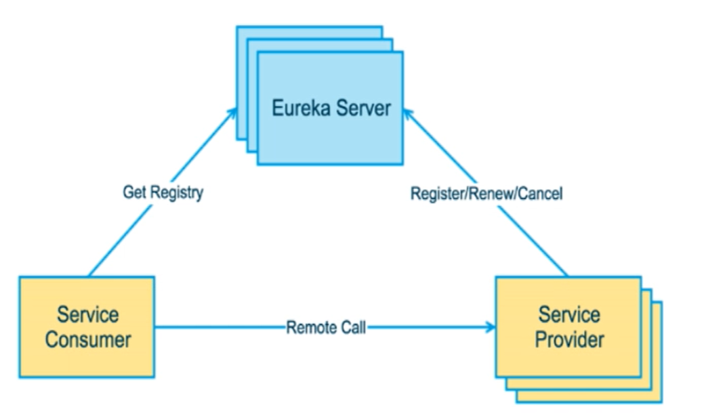
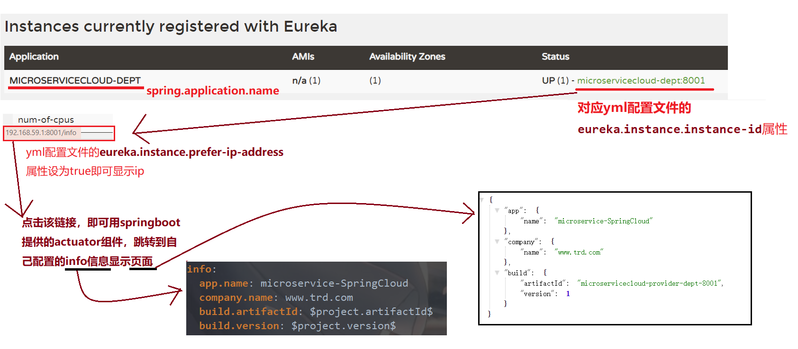
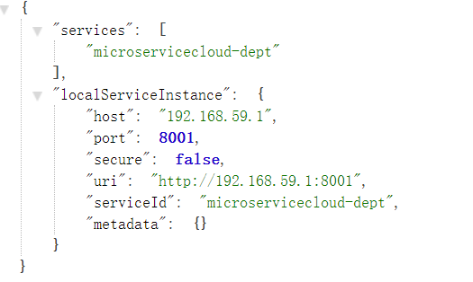
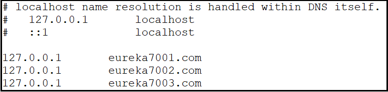
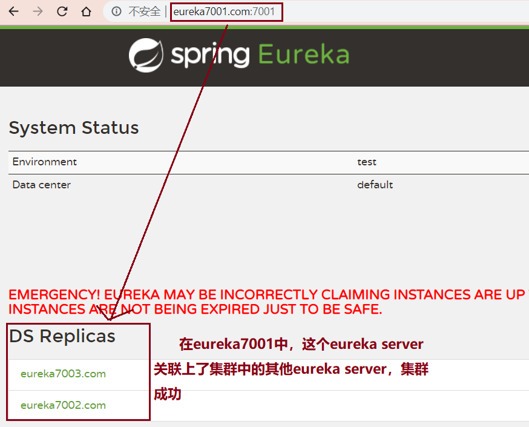
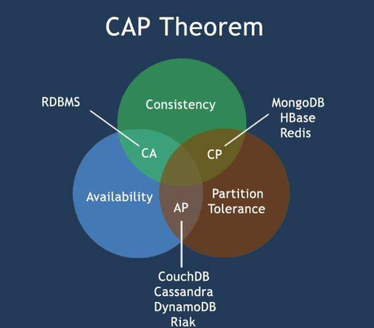

SpringCloud

### 1.springcloud架构和常用网站


> 1.官网：https://spring.io/projects/spring-cloud
>
> 2.参考书：
>
> ​	2.1、https://www.springcloud.cc/spring-cloud-netflix.html
>
> ​	2.2、API：https://www.springcloud.cc/spring-cloud-dalston.html
>
> 3.springcloud中文网：https://www.springcloud.cc/

### 2.项目版本

**spring cloud版本：Dalston.SR1**

**spring boot版本：1.5.19.RELEASE**

### 3.环境搭建

#### 	3.1父工程（microservicecloud）

* pom文件

```xml
<?xml version="1.0" encoding="UTF-8"?>
<project xmlns="http://maven.apache.org/POM/4.0.0"
         xmlns:xsi="http://www.w3.org/2001/XMLSchema-instance"
         xsi:schemaLocation="http://maven.apache.org/POM/4.0.0 http://maven.apache.org/xsd/maven-4.0.0.xsd">
    <modelVersion>4.0.0</modelVersion>

    <groupId>com.trd.springcloud</groupId>
    <artifactId>microservicecloud</artifactId>
    <version>1.0</version>
    <packaging>pom</packaging>

    <!--工具包和源码的版本管理-->
    <properties>
        <project.build.sourceEncoding>UTF-8</project.build.sourceEncoding>
        <maven.compiler.source>1.8</maven.compiler.source>
        <maven.compiler.target>1.8</maven.compiler.target>
        <junit.version>4.12</junit.version>
        <log4j.version>1.2.17</log4j.version>
        <spring-boot.version>1.5.19.RELEASE</spring-boot.version>
        <spring-cloud.version>Dalston.SR1</spring-cloud.version>
        <logback.version>1.2.3</logback.version>
        <lombok.version>1.18.6</lombok.version>
        <mybatis-spring-boot-starter.version>1.3.0</mybatis-spring-boot-starter.version>
        <!--一定要注意MySQL-Connector和Druid的版本问题，
                否则容易出现MySqlValidConnectionChecker错误-->
        <druid.version>1.0.6</druid.version>
        <mysql-connector.version>5.1.25</mysql-connector.version>
    </properties>

    <!--对子模块依赖的版本管理，不负责引进-->
    <dependencyManagement>
        <dependencies>
            <dependency>
                <groupId>org.springframework.cloud</groupId>
                <artifactId>spring-cloud-dependencies</artifactId>
                <version>${spring-cloud.version}</version>
                <type>pom</type>
                <scope>import</scope>
            </dependency>
            <dependency>
                <groupId>org.springframework.boot</groupId>
                <artifactId>spring-boot-dependencies</artifactId>
                <version>${spring-boot.version}</version>
                <type>pom</type>
                <scope>import</scope>
            </dependency>
            <dependency>
                <groupId>mysql</groupId>
                <artifactId>mysql-connector-java</artifactId>
                <version>${mysql-connector.version}</version>
            </dependency>
            <dependency>
                <groupId>com.alibaba</groupId>
                <artifactId>druid</artifactId>
                <version>${druid.version}</version>
            </dependency>
            <dependency>
                <groupId>org.mybatis.spring.boot</groupId>
                <artifactId>mybatis-spring-boot-starter</artifactId>
                <version>${mybatis-spring-boot-starter.version}</version>
            </dependency>
            <dependency>
                <groupId>log4j</groupId>
                <artifactId>log4j</artifactId>
                <version>${log4j.version}</version>
            </dependency>
            <dependency>
                <groupId>ch.qos.logback</groupId>
                <artifactId>logback-core</artifactId>
                <version>${logback.version}</version>
            </dependency>
            <dependency>
                <groupId>junit</groupId>
                <artifactId>junit</artifactId>
                <version>${junit.version}</version>
                <scope>test</scope>
            </dependency>
        </dependencies>
    </dependencyManagement>
</project>
```

#### 	3.2通用工程（microservicecloud-api）

* pom文件

```xml
<?xml version="1.0" encoding="UTF-8"?>
<project xmlns="http://maven.apache.org/POM/4.0.0"
         xmlns:xsi="http://www.w3.org/2001/XMLSchema-instance"
         xsi:schemaLocation="http://maven.apache.org/POM/4.0.0 http://maven.apache.org/xsd/maven-4.0.0.xsd">
    <modelVersion>4.0.0</modelVersion>
    <parent>
        <artifactId>microservicecloud</artifactId>
        <groupId>com.trd.springcloud</groupId>
        <version>1.0</version>
        <!--采用相对路径，改动测试起来更方便-->
        <relativePath>../microservicecloud/pom.xml</relativePath>
    </parent>

    <artifactId>microservicecloud-api</artifactId>
    <dependencies>
        <!--lombok的jar包-->
        <dependency>
            <groupId>org.projectlombok</groupId>
            <artifactId>lombok</artifactId>
        </dependency>

    </dependencies>
</project>
```

#### 	3.3服务的提供者（microservicecloud-provider-dept-8001）

* pom文件

```xml
<?xml version="1.0" encoding="UTF-8"?>
<project xmlns="http://maven.apache.org/POM/4.0.0"
         xmlns:xsi="http://www.w3.org/2001/XMLSchema-instance"
         xsi:schemaLocation="http://maven.apache.org/POM/4.0.0 http://maven.apache.org/xsd/maven-4.0.0.xsd">
    <modelVersion>4.0.0</modelVersion>
    <!--父模块-->
    <parent>
        <artifactId>microservicecloud</artifactId>
        <groupId>com.trd.springcloud</groupId>
        <version>1.0</version>
        <relativePath>../microservicecloud/pom.xml</relativePath>
    </parent>

    <artifactId>microservicecloud-provider-dept-8001</artifactId>

    <dependencies>
        <!--引入自己编写的api模块的jar包,版本跟着项目走-->
        <dependency>
            <groupId>com.trd.springcloud</groupId>
            <artifactId>microservicecloud-api</artifactId>
            <version>${project.version}</version>
        </dependency>

        <!--junit-->
        <dependency>
            <groupId>junit</groupId>
            <artifactId>junit</artifactId>
        </dependency>
        <!--mysql-->
        <dependency>
            <groupId>mysql</groupId>
            <artifactId>mysql-connector-java</artifactId>
        </dependency>
        <!--druid连接池-->
        <dependency>
            <groupId>com.alibaba</groupId>
            <artifactId>druid</artifactId>
        </dependency>
        <!--日志logback-->
        <dependency>
            <groupId>ch.qos.logback</groupId>
            <artifactId>logback-core</artifactId>
        </dependency>
        <!--mybatis整合springboot的starter-->
        <dependency>
            <groupId>org.mybatis.spring.boot</groupId>
            <artifactId>mybatis-spring-boot-starter</artifactId>
        </dependency>
        <!--springboot的web的starter-->
        <dependency>
            <groupId>org.springframework.boot</groupId>
            <artifactId>spring-boot-starter-web</artifactId>
            <!--排除Tomcat-->
            <exclusions>
                <exclusion>
                    <groupId>org.springframework.boot</groupId>
                    <artifactId>spring-boot-starter-tomcat</artifactId>
                </exclusion>
            </exclusions>
        </dependency>
        <!--嵌入式jetty服务器，不用tomcat-->
        <dependency>
            <groupId>org.springframework.boot</groupId>
            <artifactId>spring-boot-starter-jetty</artifactId>
        </dependency>
        <!--springboot的test的starter-->
        <dependency>
            <groupId>org.springframework.boot</groupId>
            <artifactId>spring-boot-starter-test</artifactId>
        </dependency>

        <!--热部署 修改后立即生效-->
        <dependency>
            <groupId>org.springframework</groupId>
            <artifactId>springloaded</artifactId>
        </dependency>
        <dependency>
            <groupId>org.springframework.boot</groupId>
            <artifactId>spring-boot-devtools</artifactId>
        </dependency>
    </dependencies>

</project>
```

* application.yml文件

```yaml
server:
  port: 8001
mybatis:
#  config-location: classpath:mybatis/mybatis.cfg.xml       mybatis配置文件的路径
  type-aliases-package: com.trd.springcloud.entities      #  mybatis别名包位置
  mapper-locations:                                       #  mybatis的mapper.xml文件路径
    - classpath:mybatis/mapper/*.xml
  configuration:
    cache-enabled: true
spring:
  application:
    name: microservicecloud-dept                          #该application的名称
  datasource:
    type: com.alibaba.druid.pool.DruidDataSource          # DataSource类型
    driver-class-name: com.mysql.jdbc.Driver              # MySQL驱动器
    username: root
    password: 123456
    url: jdbc:mysql://localhost:3306/clouddb01
    dbcp2:
      min-idle: 5                                         # 最小空闲数
      initial-size: 5                                     # DataSource初始化大小
      max-total: 5                                        # 最大连接数
      max-wait-millis: 200                                # 连接超时时间（毫秒）

```

* 启动类

```java
package com.trd.springcloud;

import org.mybatis.spring.annotation.MapperScan;
import org.springframework.boot.SpringApplication;
import org.springframework.boot.autoconfigure.SpringBootApplication;

/**
 * @author Trd
 * @date 2020-02-09 14:57
 */
// mapper的接口包扫描
@MapperScan("com.trd.springcloud.dao")
@SpringBootApplication
public class DeptProvider8001_App {
	public static void main(String[] args) {
		SpringApplication.run(DeptProvider8001_App.class,args);
	}
}

```

#### 	3.4服务的消费者（microservice-cloud-consumer-dept-80）

* pom文件

```xml
<?xml version="1.0" encoding="UTF-8"?>
<project xmlns="http://maven.apache.org/POM/4.0.0"
         xmlns:xsi="http://www.w3.org/2001/XMLSchema-instance"
         xsi:schemaLocation="http://maven.apache.org/POM/4.0.0 http://maven.apache.org/xsd/maven-4.0.0.xsd">
    <parent>
        <artifactId>microservicecloud</artifactId>
        <groupId>com.trd.springcloud</groupId>
        <version>1.0</version>
        <relativePath>../microservicecloud/pom.xml</relativePath>
    </parent>
    <modelVersion>4.0.0</modelVersion>

    <artifactId>microservicecloud-consumer-dept-80</artifactId>
    <dependencies>
        <!--引入自己编写的api模块的jar包,版本跟着项目走-->
        <dependency>
            <groupId>com.trd.springcloud</groupId>
            <artifactId>microservicecloud-api</artifactId>
            <version>${project.version}</version>
        </dependency>
        <!--springboot的web的starter-->
        <dependency>
            <groupId>org.springframework.boot</groupId>
            <artifactId>spring-boot-starter-web</artifactId>
        </dependency>
        <!--热部署 修改后立即生效-->
        <dependency>
            <groupId>org.springframework</groupId>
            <artifactId>springloaded</artifactId>
        </dependency>
        <dependency>
            <groupId>org.springframework.boot</groupId>
            <artifactId>spring-boot-devtools</artifactId>
        </dependency>
    </dependencies>

</project>
```

* yml文件

```yaml
server:
  port: 80             # 只更改服务的端口
```

### 4.Eureka

#### 4.1Eureka是什么？

​		Eureka是一个**基于REST**的服务，用于定位服务，以实现云端中间层**服务发现和故障转移**。**只使用服务的标识符，就可以访问到服务**，而**不需要修改服务调用的配置文件**。类似于dubbo的注册中心，比如Zookeeper。



#### 4.2Eureka服务端的配置（microservicecloud-eureka-7001）

	* pom文件

```xml
<?xml version="1.0" encoding="UTF-8"?>
<project xmlns="http://maven.apache.org/POM/4.0.0"
         xmlns:xsi="http://www.w3.org/2001/XMLSchema-instance"
         xsi:schemaLocation="http://maven.apache.org/POM/4.0.0 http://maven.apache.org/xsd/maven-4.0.0.xsd">
    <modelVersion>4.0.0</modelVersion>
    <parent>
        <artifactId>microservicecloud</artifactId>
        <groupId>com.trd.springcloud</groupId>
        <version>1.0</version>
        <relativePath>../microservicecloud/pom.xml</relativePath>
    </parent>

    <artifactId>microservicecloud-eureka-7001</artifactId>

    <dependencies>
        <!--eureka-server 服务端-->
        <dependency>
            <groupId>org.springframework.cloud</groupId>
            <artifactId>spring-cloud-starter-eureka-server</artifactId>
        </dependency>
        <!--热部署 修改后立即生效-->
        <dependency>
            <groupId>org.springframework</groupId>
            <artifactId>springloaded</artifactId>
        </dependency>
        <dependency>
            <groupId>org.springframework.boot</groupId>
            <artifactId>spring-boot-devtools</artifactId>
        </dependency>

    </dependencies>

</project>
```

	* application.yml文件

```yaml
server:
  port: 7001					# 设置Eureka的server端的端口

eureka:
  instance:
    hostname: localhost         # eureka服务端的实例名称,本机注册就是localhost
  client:
    register-with-eureka: false #   false表示不向注册中心注册自己
    fetch-registry: false       #  false 表示自己就是注册中心，职责就是维护服务实例，并不需要去检索服务
    service-url:
      defaultZone: http://${eureka.instance.hostname}:${server.port}/eureka/ #设置与eureka server 交互的地址查询服务和注册服务都需要依赖的地址
```

	* 在该项目的**启动类上加@EnableEurekaServer注解**，用来**启动Eureka的服务端，接受其它微服务的注册**
	* 测试：浏览器打开 localhost:7001,出现

标准，则成功

#### 4.3在以前的项目中新增配置，完善Eureka

* 模块microservicecloud-provider-dept-8001的pom文件新增

  ```xml
      <!--将微服务provider注册进eureka-->
      <!--eureka的client端，和cloud的config-->
      <dependency>
          <groupId>org.springframework.cloud</groupId>
          <artifactId>spring-cloud-starter-eureka</artifactId>
      </dependency>
      <dependency>
          <groupId>org.springframework.cloud</groupId>
          <artifactId>spring-cloud-starter-config</artifactId>
      </dependency>     
      <!--actuator（制动器），监控自信息完善-->
      <dependency>
          <groupId>org.springframework.boot</groupId>
          <artifactId>spring-boot-starter-actuator</artifactId>
      </dependency>
  ```

* 模块microservicecloud-provider-dept-8001的yml文件新增

  ```yaml
  #客户端注册进eureka服务列表
  eureka:
    client:
      service-url:
        defaultZone: http://localhost:7001/eureka
    instance:
      instance-id: microservicecloud-dept:8001   # Eureka的服务端的该微服务名Status名修改
      prefer-ip-address: true                    # 访问路径显示IP地址
  info:
    app.name: microservice-SpringCloud
    company.name: www.trd.com
    build.artifactId: $project.artifactId$
    build.version: $project.version$
  ```

* 模块microservicecloud-provider-dept-8001的启动类上新加注解**@EnableEurekaClient**，用来**启动Eureka的client端，将其注册到Eureka的server端**

* 父工程（microservicecloud）的pom文件添加

  ```xml
      <build>
          <!--finalName 父工程名称-->
          <finalName>microservicecloud</finalName>
          <resources>
              <resource>
                  <!--开启maven工程的主resource的所有文件过滤-->
                  <directory>src/main/resources</directory>
                  <filtering>true</filtering>
              </resource>
          </resources>
          <!--增加插件-->
          <plugins>
              <plugin>
                  <groupId>org.apache.maven.plugins</groupId>
                  <artifactId>maven-resources-plugin</artifactId>
                  <version>3.0.2</version>
                  <!--配置插件解析-->
                  <configuration>
                      <delimiters>
                          <!--占位符的替换规则设置，
                              以$符为界限,取过滤的resources中以$*$之间的信息-->
                          <delimiter>$</delimiter>
                      </delimiters>
                  </configuration>
              </plugin>
          </plugins>
      </build>
  ```

* 8001的yml文配置新增图解

#### 4.4Eureka的自我保护机制

* Eureka遵循AP原则，ZooKeeper遵循CP原则
* 自我保护提示

>​		默认情况下，**如果EurekaServer在一定时间内没有接收到某个微服务实例的心跳，Eureka Server将会注销实例（默认90秒）**。但是当网络分区故障发生时，微服务与Eureka Server之间无法正常通信，以上行为可能变得非常危险，因为微服务本身其实是健康的，此时本不应该注销这个服务。Eureka通过“自我保护模式”来解决这个问题，**当Eureka Server节点在短时间内丢失过多客户端时（可能发生网络故障），那么这个节点就会进入自我保护模式**。一旦**进入该模式，Eureka Server就会保护服务注册表中的信息，不再删除服务注册表中的数据（也即不会注销任何微服务）。当网络故障恢复后，该Eureka Server节点会自动退出自我保护模式。**
>
>​		**在自我保护模式中，Eureka Server会保护服务注册表中的信息，不再注销任何实例。当它收到的心跳数重新恢复到阈值以上时，该Eureka Server 节点就会自动退出自我保护模式。宁可保留错误的服务注册信息，也不盲目注销任何健康的服务实例，好死不如赖活着。使用自我保护模式，可以让Eureka集群更加的健壮、稳定。**
>
>​	在springcloud中，可以配置eureka.server.enable-self-preservation=false来禁用自我保护模式（不推荐）

#### 4.5Eureka服务发现（discovery）

> 对于注册进Eureka里的微服务，可以痛过服务发现来获取该服务的信息

* microservicecloud-provider-dept-8001模块里的Controller加入

  ```java
      // IDEA提示有两个DiscoveryClient,用@Qualifier限定一下
      @Autowired
      @Qualifier("discoveryClient")
      private DiscoveryClient client;
  
  	@GetMapping(value = "/dept/discovery")
  	public Object discovery(){
  		// 获取全部服务的id
  		List<String> list = client.getServices();
  		System.out.println("全部服务"+list);
  		// 查询serviceId对应的服务实例
  		List<ServiceInstance> instances = client.getInstances("microservicecloud-dept");
  
  		for (ServiceInstance element :instances){
  			System.out.println("serviceId: "+element.getServiceId());
  			System.out.println("host: "+element.getHost());
  			System.out.println("port: "+element.getPort());
  			System.out.println("uri: "+element.getUri());
  		}
  		return this.client;
  	}
  ```

* microservicecloud-provider-dept-8001启动类加入**@EnableDiscoveryClient**注解（我没有加入也成功了）

* 访问localhost:8001/dept/discovery，出现如下，则成功

#### 4.5 Eureka的集群

##### 1.C:/Windows/System32/drivers/etc/hosts文件新增以下域名映射

##### 2.新增microservicecloud-eureka-7002和microservicecloud-eureka-7003模块

* yml和pom文件复制microservicecloud-eureka-7001的

* yml文件修改部分(defaultZone互相添加其他的url，以microservicecloud-eureka-7002为例)

  ```yml
  eureka:
    instance:
      hostname: eureka7002.com  # 因为集群配置中hostname不能重复，所以在hosts文件中做了映射
  eureka:
    client:
      service-url:
      # 单机版配置 
      # defaultZone: http://${eureka.instance.hostname}:${server.port}/eureka/ #设置与eureka server 交互的地址查询服务和注册服务都需要依赖的地址
      # 集群配置
        defaultZone:
        	http://eureka7001.com:7001/eureka/,http://eureka7003.com:7003/eureka/
  ```

* 启动类和microservicecloud-eureka-7001一样

##### 3.microservicecloud-provider-dept-8001yml文件修改

```yaml
#客户端注册进eureka服务列表
eureka:
  client:
    service-url:
      defaultZone: 		     	# eureka客户端添加其余所有的集群eureka server的url  
         http://eureka7001.com:7001/eureka,
         http://eureka7002.com:7002/eureka,
         http://eureka7003.com:7003/eureka
```

##### 4.测试

输入eureka server的url，看到如下，则集群成功

#### 4.6Eureka和zookeeper的比较

##### 1.CAP理论

> ​		**一个分布式系统不可能同时很好地满足一致性(Consistency)、可用性(Availability )和分区容错性(Partition tolerance)**，**最多只能较好的同时满足两个**。因此，根据CAP原理将NoSQL数据库分成了满足CA原则、CP原则和AP原则三类
>
> CA：单点集群，满足一致性，可用性的系统，可扩展性则不强
>
> CP：满足一致性，分区容忍性的系统，通常性能不高
>
> AP：满足可用性，分区容忍性的系统，对一致性的要求低一些

**而由于当前的网络硬件肯定会出现延迟丢包等问题，所以，分区容错性我们必须要实现**

##### 2.zookeeper保证CP

> ​		**当zookeepe的master节点因为网络故障与其他节点失去联系时，剩余节点会重新进行leader选举。如果leader选举时间过长，30~120s，则这个期间整个zookeeper集群都不可用，导致这期间服务瘫痪**。而在云部署的情况下，网络问题让zookeeper集群失去master节点概率较大，尽管最终能恢复，但选举时间长使我们不能容忍的。

##### 3.Eureka保证AP

>​		**Eureka的各个节点都平等**，几个节点挂掉不会影响正常节点的工作，剩余节点依然可提供服务。因为**Eureka客户端在向某个Eureka注册或时如果发现连接失败，则会自动切换至其它节点，只要有一台Eureka还在,就能保证注册服务可用(保证可用性)**，只不过查到的信息可能不是最新的(**不保证强一致性**)。除此之外，Eureka还有一种**自我保护机制**，如果在15分钟内超过85%的节点都没有正常的心跳,那么Eureka就认为客户端与注册中心出现了网络故障，此时会出现以下几种情况:
>1. Eureka不再从注册列表中移除因为长时间没收到心跳而应该过期的服务
>2. Eureka仍然能够接受新服务的注册和查询请求，但是不会被同步到其它节点上(即保证当前节点依然可用)
>3. 当网络稳定时，当前实例新的注册信息会被同步到其它节点。

​		**因此，Eureka可以很好的应对因网络故障导致部分节点失去联系的情况，而不会像zookeeper那样使整 个注册服务瘫痪。**